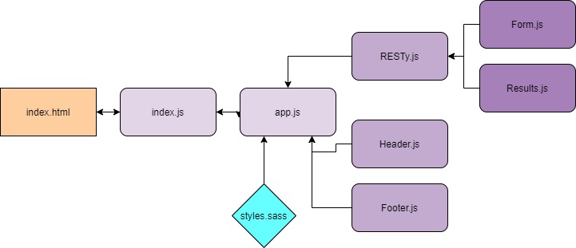

# LAB - Class 23

## "Props and State" React App

### Author: Madison Stehle

### Links and Resources

- [submission PR](https://github.com/madisonstehle/props-and-state-react/pull/1)
- [app code in codesandbox](https://codesandbox.io/s/props-and-state-react-u7hwk?file=/src/App.js)
- [front-end application](https://u7hwk.codesandbox.io/)

### Setup

#### How to initialize/run the application

- If using on a local machine, `npm start` will start the app on localhost.
- Otherwise, the link above to the front-end application will take you to the site.

#### UML

